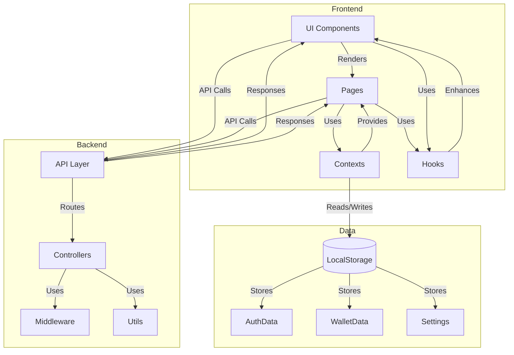
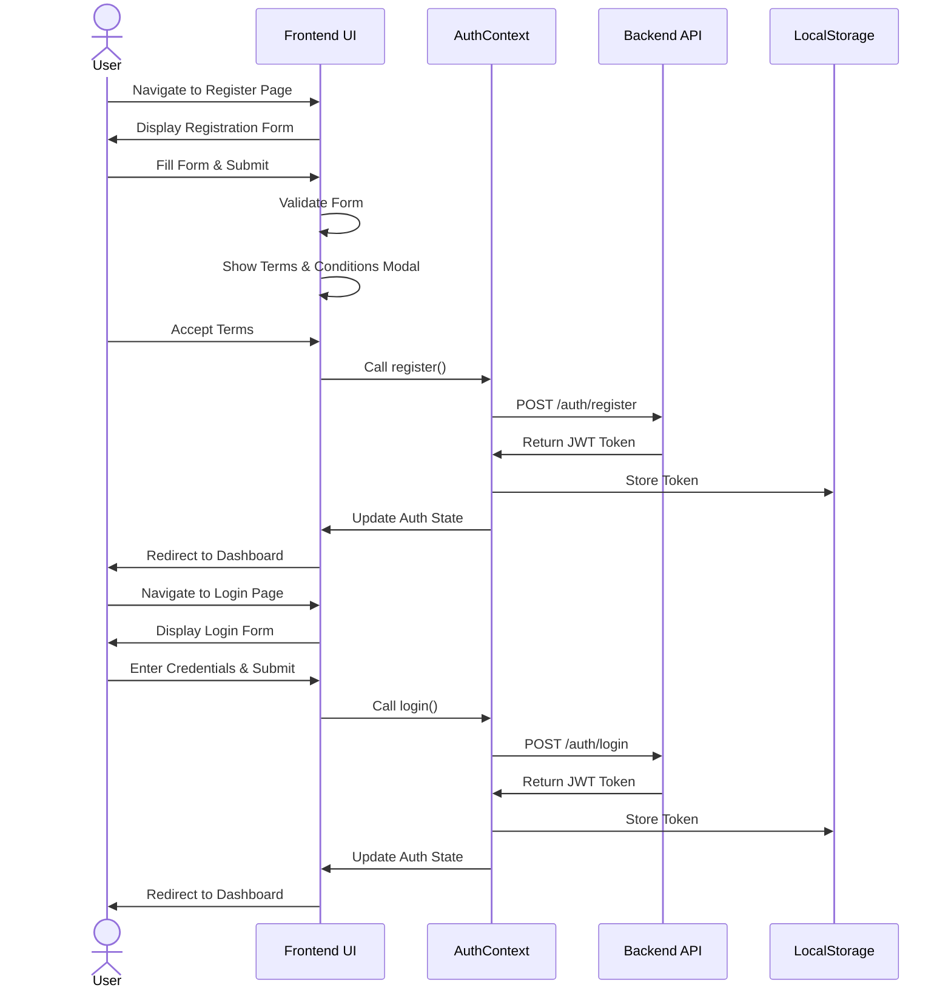
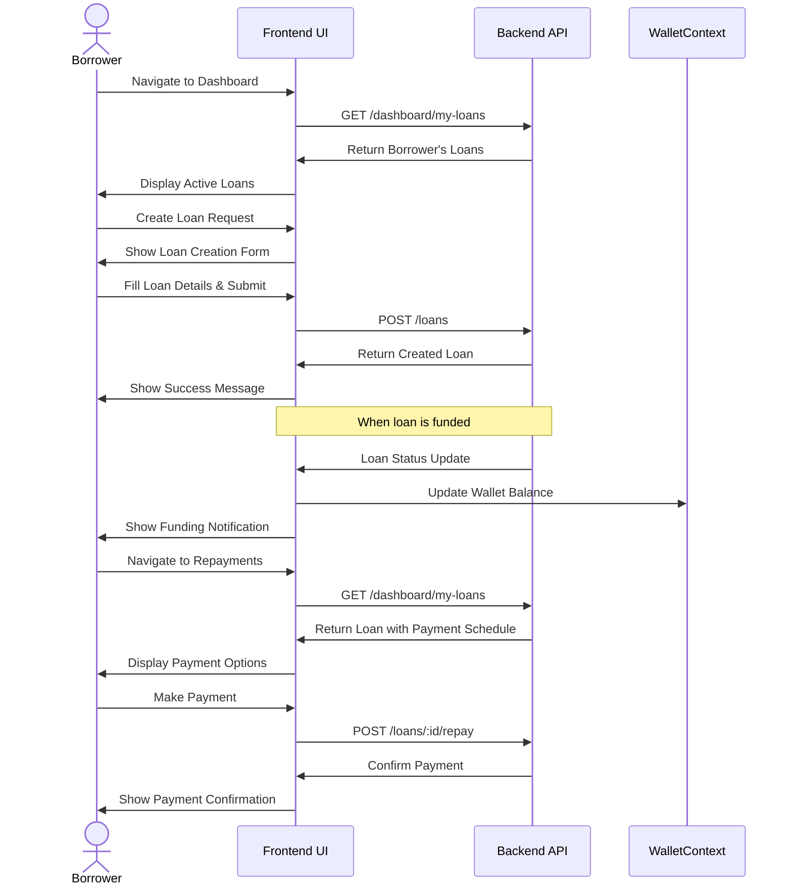
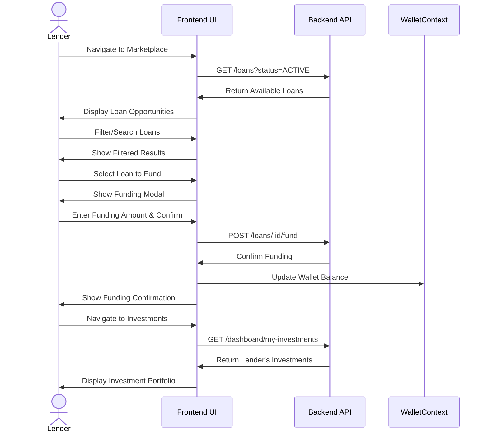
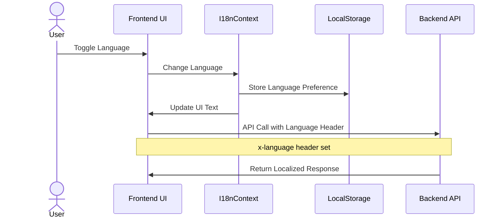
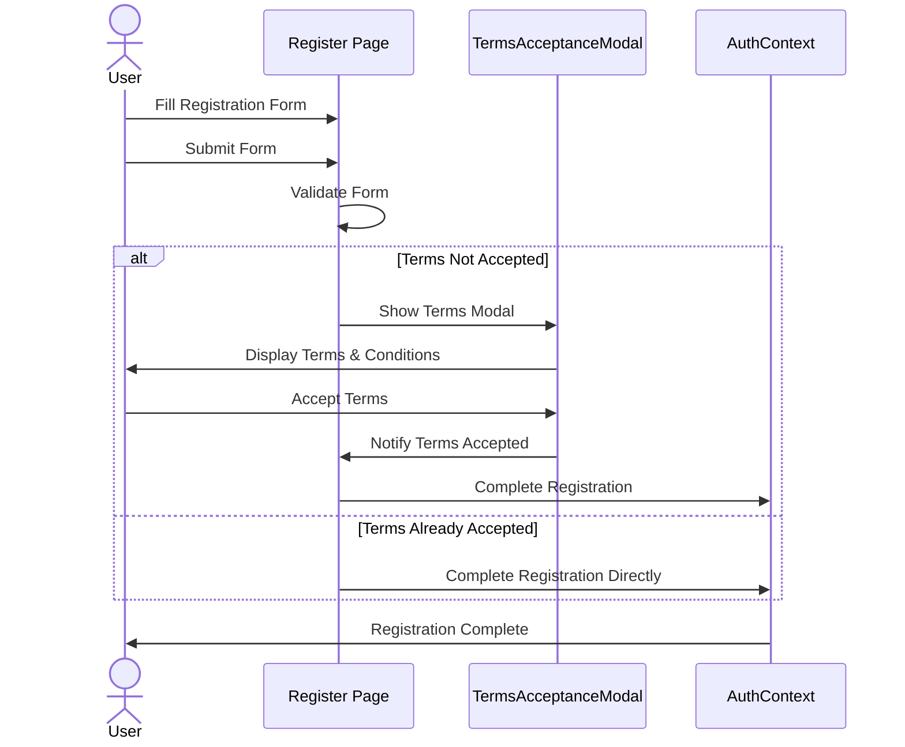
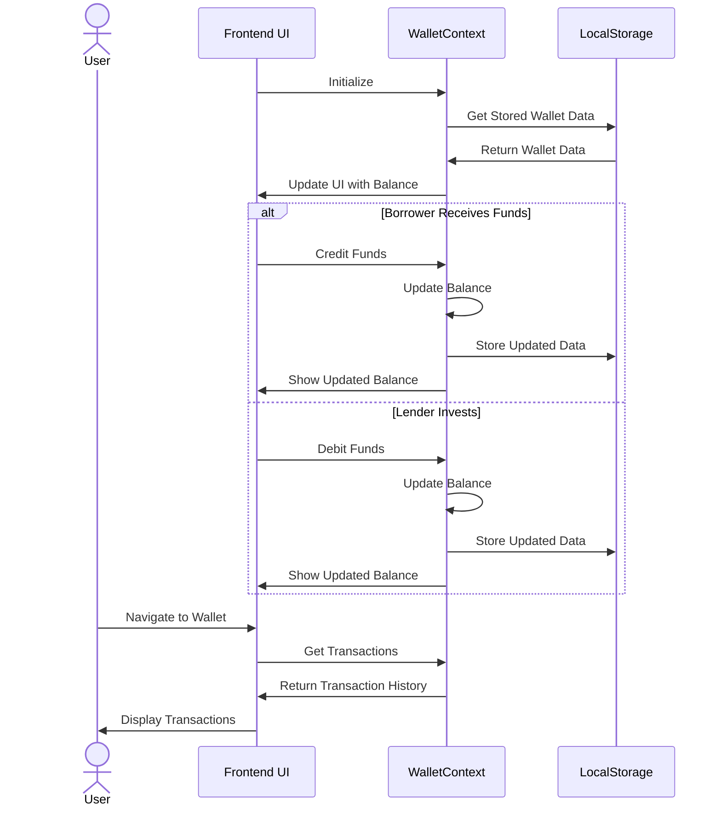
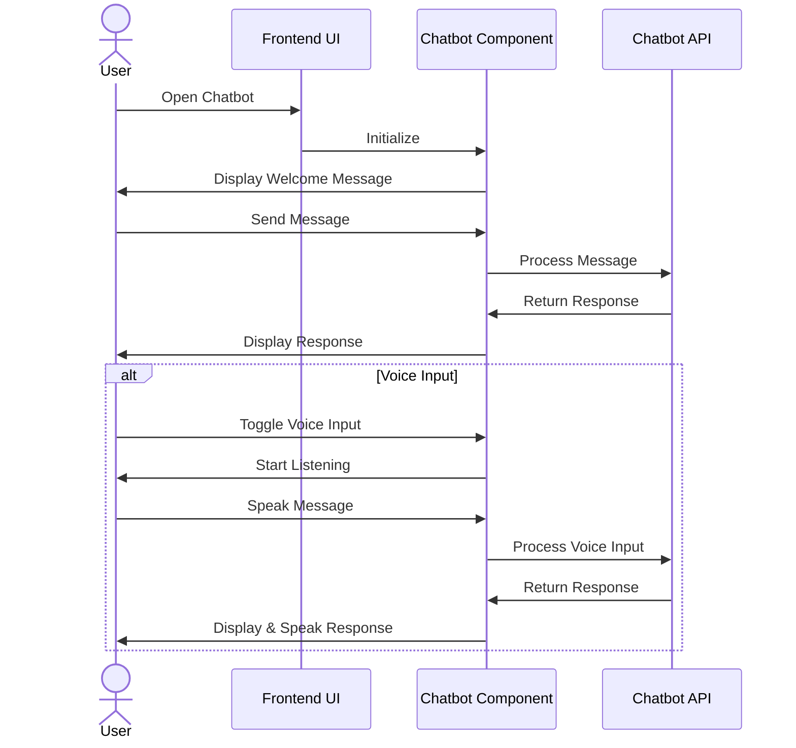

# Kshetra Kredit - Project Workflow Diagram

This document provides a comprehensive workflow diagram for the Kshetra Kredit peer lending platform, illustrating the main user flows, system components, and their interactions.

## System Architecture

## User Authentication Flow

## Borrower Workflow

## Lender Workflow

## Multi-language Support Flow

## Terms & Conditions Acceptance Flow

## Wallet System Flow

## Chatbot Interaction Flow

This comprehensive workflow diagram illustrates the key processes and interactions within the Kshetra Kredit platform, providing a clear visualization of how the different components work together to deliver the application's functionality.