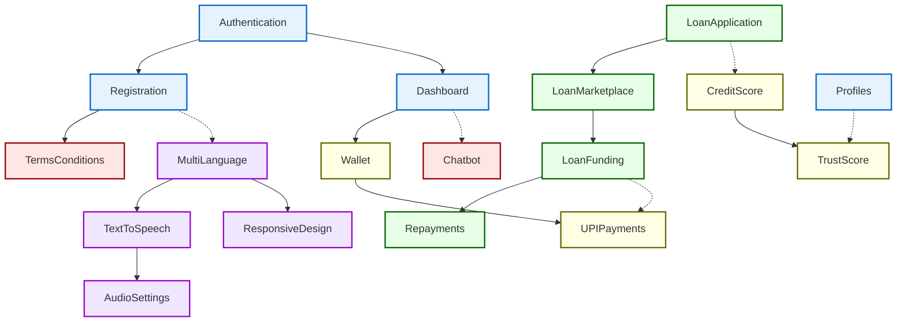
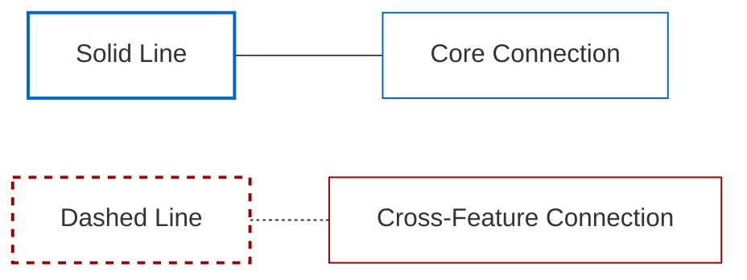

# Kshetra Kredit Website Features

This document provides a visual representation of the Kshetra Kredit website features using Mermaid diagrams.

## Main Feature Categories

```mermaid
graph TB
    %% Styling
    classDef userFeatures fill:#E6F3FF,stroke:#0066CC,stroke-width:2px
    classDef lendingFeatures fill:#E6FFE6,stroke:#006600,stroke-width:2px
    classDef accessibilityFeatures fill:#F0E6FF,stroke:#9900CC,stroke-width:2px
    classDef financialFeatures fill:#FFFFE6,stroke:#666600,stroke-width:2px
    classDef supportFeatures fill:#FFE6E6,stroke:#990000,stroke-width:2px
    classDef coreFeature fill:#FFFFCC,stroke:#333333,stroke-width:2px,stroke-dasharray: 5 5
    classDef enhancedFeature fill:#E6FFFF,stroke:#333333,stroke-width:1px,stroke-dasharray: 5 5
    
    %% Main categories
    UserFeatures["User Features"] 
    LendingFeatures["Lending Features"]
    AccessibilityFeatures["Accessibility Features"]
    FinancialFeatures["Financial Features"]
    SupportFeatures["Support Features"]
    
    %% User Features
    UserFeatures --> Authentication["Authentication System"]
    UserFeatures --> Registration["User Registration"]
    UserFeatures --> Profiles["User Profiles"]
    UserFeatures --> Dashboard["Personalized Dashboard"]
    
    %% Lending Features
    LendingFeatures --> LoanApplication["Loan Application"]
    LendingFeatures --> LoanMarketplace["Loan Marketplace"]
    LendingFeatures --> LoanFunding["Loan Funding"]
    LendingFeatures --> Repayments["Repayment System"]
    
    %% Accessibility Features
    AccessibilityFeatures --> MultiLanguage["Multi-language Support"]
    AccessibilityFeatures --> TextToSpeech["Text-to-Speech Capability"]
    AccessibilityFeatures --> AudioSettings["Audio Settings"]
    AccessibilityFeatures --> ResponsiveDesign["Responsive Design"]
    
    %% Financial Features
    FinancialFeatures --> Wallet["Digital Wallet"]
    FinancialFeatures --> UPIPayments["UPI Payments"]
    FinancialFeatures --> CreditScore["Credit Score System"]
    FinancialFeatures --> TrustScore["Trust Score System"]
    
    %% Support Features
    SupportFeatures --> Chatbot["AI Chatbot"]
    SupportFeatures --> TermsConditions["Terms & Conditions"]
    SupportFeatures --> VideoBackground["Video Background"]
    SupportFeatures --> ThemeToggle["Theme Toggle"]
    
    %% Apply classes
    class UserFeatures,Authentication,Registration,Profiles,Dashboard userFeatures
    class LendingFeatures,LoanApplication,LoanMarketplace,LoanFunding,Repayments lendingFeatures
    class AccessibilityFeatures,MultiLanguage,TextToSpeech,AudioSettings,ResponsiveDesign accessibilityFeatures
    class FinancialFeatures,Wallet,UPIPayments,CreditScore,TrustScore financialFeatures
    class SupportFeatures,Chatbot,TermsConditions,VideoBackground,ThemeToggle supportFeatures
```

## Feature Relationships

## Core vs Enhanced Features

```mermaid
graph TB
    %% Styling
    classDef userFeatures fill:#E6F3FF,stroke:#0066CC,stroke-width:2px
    classDef lendingFeatures fill:#E6FFE6,stroke:#006600,stroke-width:2px
    classDef accessibilityFeatures fill:#F0E6FF,stroke:#9900CC,stroke-width:2px
    classDef financialFeatures fill:#FFFFE6,stroke:#666600,stroke-width:2px
    classDef supportFeatures fill:#FFE6E6,stroke:#990000,stroke-width:2px
    classDef coreFeature fill:#FFFFCC,stroke:#333333,stroke-width:2px,stroke-dasharray: 5 5
    classDef enhancedFeature fill:#E6FFFF,stroke:#333333,stroke-width:1px,stroke-dasharray: 5 5
    
    %% Core Features
    CoreFeatures["Core Features"]
    CoreFeatures --> Authentication
    CoreFeatures --> LoanApplication
    CoreFeatures --> LoanMarketplace
    CoreFeatures --> Dashboard
    CoreFeatures --> Wallet
    
    %% Enhanced Features
    EnhancedFeatures["Enhanced Features"]
    EnhancedFeatures --> MultiLanguage
    EnhancedFeatures --> TextToSpeech
    EnhancedFeatures --> Chatbot
    EnhancedFeatures --> ThemeToggle
    EnhancedFeatures --> UPIPayments
    
    %% Apply classes
    class Authentication,LoanApplication,LoanMarketplace,Dashboard,Wallet userFeatures
    class MultiLanguage,TextToSpeech,Chatbot,ThemeToggle,UPIPayments enhancedFeature
    class CoreFeatures coreFeature
    class EnhancedFeatures enhancedFeature
```

## Legend

## Feature Categories Description

### User Features
- **Authentication System**: Secure login and session management
- **User Registration**: New user onboarding with verification
- **User Profiles**: Customizable user information and preferences
- **Personalized Dashboard**: User-specific overview and controls

### Lending Features
- **Loan Application**: Process for borrowers to request funds
- **Loan Marketplace**: Platform for lenders to browse loan opportunities
- **Loan Funding**: Mechanism for lenders to fund loan requests
- **Repayment System**: Structure for managing loan repayments

### Accessibility Features
- **Multi-language Support**: Interface in multiple languages (English, Hindi)
- **Text-to-Speech**: Audio narration of content for accessibility
- **Audio Settings**: Customizable audio preferences
- **Responsive Design**: Adapts to different screen sizes and devices

### Financial Features
- **Digital Wallet**: Virtual account for managing funds
- **UPI Payments**: Integration with Unified Payments Interface
- **Credit Score System**: Assessment of borrower creditworthiness
- **Trust Score System**: Reputation metrics for platform users

### Support Features
- **AI Chatbot**: Automated assistance for users
- **Terms & Conditions**: Legal framework and user agreements
- **Video Background**: Engaging visual elements
- **Theme Toggle**: Light/dark mode preferences